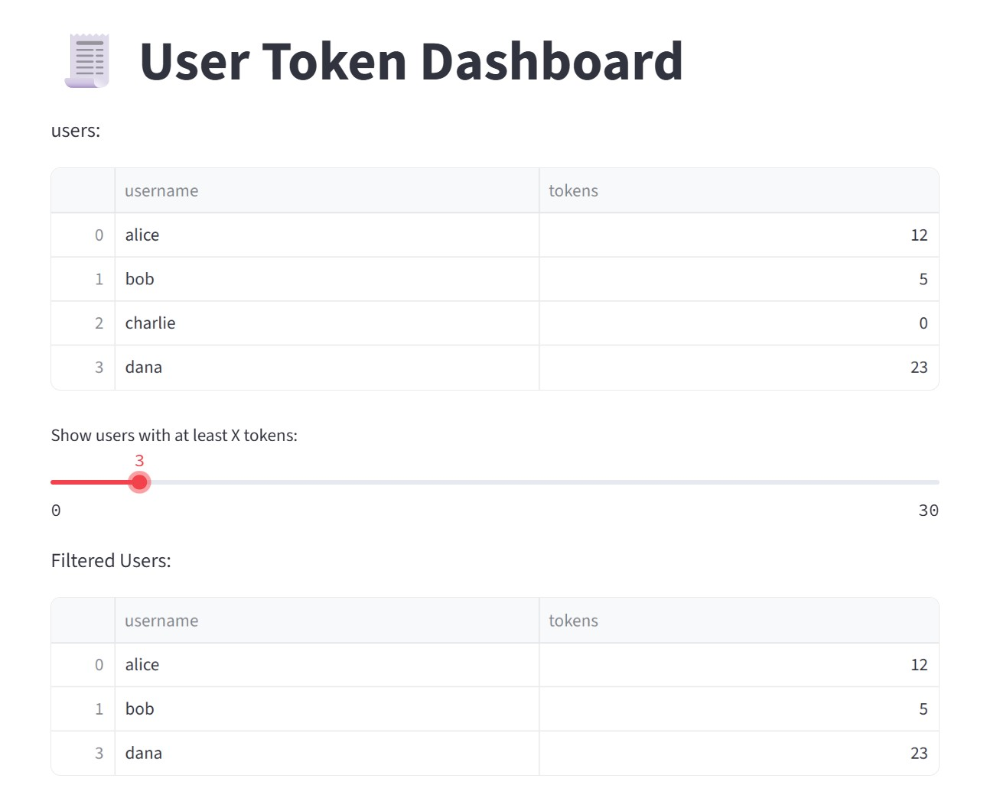

# 📊 Final Project: FastAPI Server for Model Training and Prediction
# Part B: User Monitoring, Tokens, and Admin GUI



## 📦 1. User Monitoring in Database (Token System)

### 🔐 User Table (PostgreSQL or MongoDB)

Create a `users` table/collection with the following fields:

* `username`: string (unique)
* `password`: string (hashed)
* `tokens`: integer (default: 0)

Every REST API operation will require:

* **1 token per training or metadata request**
* **5 tokens per prediction request**

### 🛠️ API Endpoints

#### ✅ `POST /signup`

Registers a new user

```json
{
  "username": "bob",
  "password": "1234"
}
```

#### ❌ `DELETE /remove_user`

Deletes a user by username and password

```json
{
  "username": "bob",
  "password": "1234"
}
```

#### 📦 `GET /tokens/{username}`

Returns the number of tokens a user has

```json
{
  "tokens": 14
}
```

#### 💳 `POST /add_tokens`

Adds tokens to a user account

```json
{
  "username": "bob",
  "credit_card": "1234-5678-9999-0000",
  "amount": 10
}
```

(You may simulate the credit card logic for now)

### 🔒 Token Enforcement

Before performing any model-related action:

* Check user credentials (username + password)
* Ensure the user has enough tokens
* Deduct tokens accordingly (1 for most, 5 for predictions)

Use **Postman** to test all endpoints.

---

## 🖥️ 2. Streamlit GUI: User Tokens Dashboard

Build a simple Streamlit dashboard that displays:

* A table of all users
* The number of tokens per user

You may use a direct connection to the database to query user data.

---

## 🪵 3. Logging System

Implement a logging system to record all important events, such as:

* New user registration
* User deletion
* Token purchases
* Prediction or training actions
* Token usage per action

Use Python's built-in `logging` module, write logs to a file like `server.log`:

```python
logging.info(f"User {username} registered")
logging.warning(f"User {username} tried to predict without enough tokens")
```

---

## 🎁 BONUS: Use JWT Instead of Username+Password in Requests

### 🔑 `POST /login`

Creates a JWT token after verifying username and password:

```json
{
  "username": "bob",
  "password": "1234"
}
```

Returns:

```json
{
  "access_token": "<JWT_TOKEN>",
  "token_type": "bearer"
}
```

Use the JWT token in all subsequent API calls via the `Authorization` header:

```
Authorization: Bearer <JWT_TOKEN>
```

### ✍️ Integration Steps:

* Implement token generation and decoding using `pyjwt` or FastAPI's `OAuth2PasswordBearer`
* Replace all username/password checks with JWT authentication
* Add a dependency to check token validity in all protected routes

---

> Make sure Part B is well integrated with Part A. Use the same FastAPI app and add these endpoints to the existing codebase.
